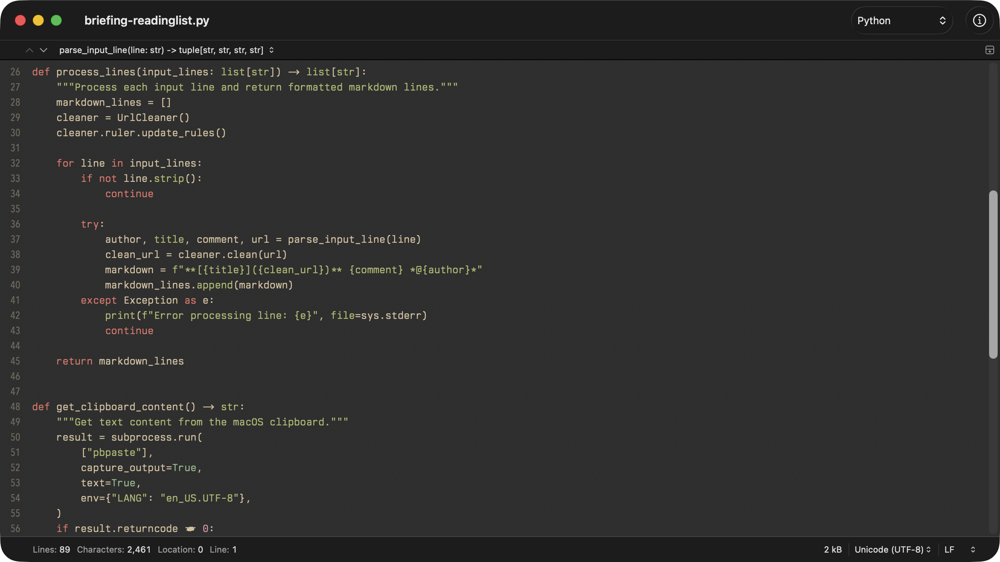

# Gruvbox Material for CotEditor

A [Gruvbox Material](https://github.com/sainnhe/gruvbox-material) color scheme ported to [CotEditor](https://coteditor.com/), the lightweight macOS text editor.

Includes two variants:

- **Gruvbox Material** — Dark medium background (`#282828`)
- **Gruvbox Material Hard** — Darker background for higher contrast (`#1d2021`)



## Installation

1. Download or clone this repository.
2. Double-click the `.cottheme` file(s) you want to install. CotEditor will import them automatically.

Alternatively, copy the `.cottheme` files to:

```
~/Library/Application Support/CotEditor/Themes/
```

## Activation

1. Open **CotEditor** → **Settings** (`⌘,`) → **Appearance**.
2. Select **Gruvbox Material** or **Gruvbox Material Hard** from the theme list.

## Color Palette

| Element    | Color     |
| ---------- | --------- |
| Text       | `#d4be98` |
| Comments   | `#928374` |
| Keywords   | `#ea6962` |
| Strings    | `#a9b665` |
| Types      | `#d8a657` |
| Variables  | `#7daea3` |
| Numbers    | `#d3869b` |
| Attributes | `#e78a4e` |
| Values     | `#89b482` |

## Credits

Based on [Gruvbox Material](https://github.com/sainnhe/gruvbox-material) by [sainnhe](https://github.com/sainnhe).

## License

[MIT](LICENSE)
